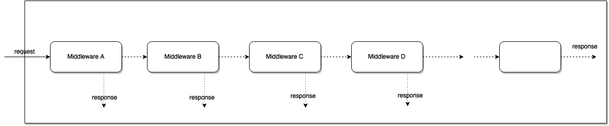
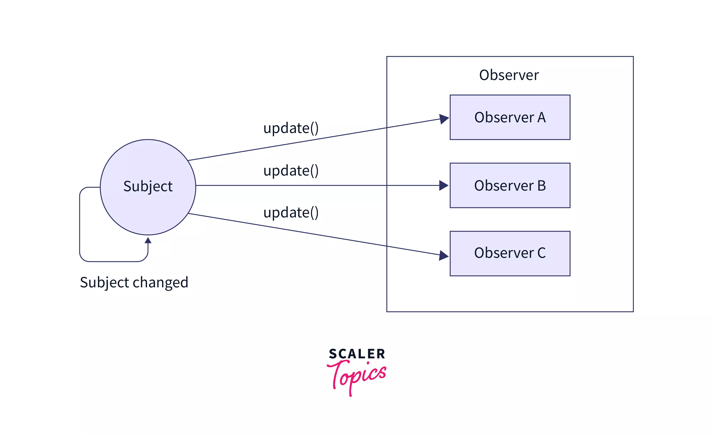

# Board Games Meet-up App

## Product Description
The scope of this project encompasses the development of an application or platform that allows users to perform the following actions:

- Enter board game events, specifying event details.

- Register for events and express game preferences.

- Suggest new games to be played at events.

- Initiate game selection when the required number of players is reached.

- Manage check-in to validate event participation.

- Maintain a database of games and their associated rules.

- Award badges to players based on various achievements.

- Enable users to recognize the best player of an event.

- Allow users to report the behavior of other participants.

This software aims to enhance the organization of board game events and foster a vibrant gaming community.

## Functional Requirements

### User Registration and Login
The system shall allow users to register with a unique username or valid email and password. During registration, users should also provide some personal information, including their name and city. The system should validate their email, username, and the password should follow guidelines for security.

### Event Creation
Registered users shall have the ability to create new board game events. For each event, the user shall specify the event's name, venue, date, and time. Users can set the minimum and maximum number of players required for the event.

During event creation, users can specify the games that are available to be played. Users can express their own preferences for games to be played at the event.

### Event Management
The user who initiated an event can select a game to be played. Game selection can only occur when the required number of players for the chosen game is reached. The system shall notify registered users about the selected game.

Users must check in to validate their participation in the event. The system shall record and display the list of checked-in participants for each event.

### Board Games Library
The system shall maintain a database of games, including their names, detailed rules, and the number of participants required. Users can search and browse the game database to find information about available games.

### Badge System
Players shall earn badges based on achievements, such as knowing the rules, playing a certain number of games, or helping other players. The system shall track and display the badges earned by each player.

Users can choose and recognize the best player of an event. The system shall display the best player of each event based on user votes.

### User Behavior Reporting
Users can report the behavior of other participants, indicating whether they were fair, competitive, or displayed other behavior traits. The system shall record and display user reports for reference.

### Administrator System
An administrator should have the ability to create and manage the badges in the system. Also, they can add new board games to the database.

## Non-Functional Requirements

### Performance
The system should provide responsive user interfaces, with page load times not exceeding 2 seconds. Response times for event updates and notifications should be minimized to ensure real-time updates. It should support a concurrent user load of at least 100 users without a significant decrease in performance.

### Security
User data must be encrypted both in transit and at rest. Authentication and authorization mechanisms should be implemented to protect user accounts and sensitive data.

## System Architecture and Analysis 

### General overview - flowchart diagram

The flowchart illustrates the user journey within the app, starting with user registration and login processes. Clients have options such as viewing board games, viewing and updating personal information, setting game preferences, and checking earned badges. The flow includes features like viewing and registering for events, creating events, concluding events, and choosing the best player. 

For administrators, the options include viewing and editing badges as well as managing board games information. Decision points are represented, such as choosing to register, login and selecting the best player. The flowchart provides a visual roadmap for clients and administrators, outlining the logical sequence of actions and interactions within the app, promoting clarity in functionality and decision-making processes.

### UML Class Diagram

The diagram depicts the main classes of the application with their representitive methods. Highlighted with orange are the parts unavailable at the moment in the MVP.

### UML Use Case Diagram

The diagram depicts the represenation of the functional requirements from the user's perspective. It uses the actors client, admin and organiser in order to portrait the actions available in the application. 

### Database Diagram

The diagram depicts the database structure of the application. Highlighted with red are the parts unavailable at the moment in the MVP.

### Activity Diagrams

The diagrams showcase the activities, actions and decisions in the application flow. 

### Package Diagram

The diagram shows how the application code is structured. 

## Design patters
### Middleware 
- intre request si response sunt executate diferite metode
- aceste metode valideaza request-urile, token-ul de autentificare si erori care pot aparea
- de asemenea, aceste metode pot modifica request-ul sau response-ul inainte de trece la apelarea urmatoarelor metode
- aceste ajuta la crearea un cod care nu se repeta si la adaugarea usoara a functionalitatilor la metodele deja existente

 https://medium.com/@techsuneel99/design-patterns-in-node-js-31211904903e

 ### Singleton & Observer
 - pentru a avea o singura stare a aplicatiei (sub forma unui arbore), folosim redux. Acesta este un <b>singleton</b> si se initializeaza o singura data pentru client
 
 https://www.digitalocean.com/community/tutorials/java-singleton-design-pattern-best-practices-examples
 - de asemenea, cu ajutorul redux, am implementat <b>observer pattern</b>. Redux gestioneaza request-urile care se fac si rezultatul lor, dupa care componentele sunt instintate daca starea s-a schimbat, pentru a afisa continutul relevant. (De ex.: user-ul incearca sa se inregistreze, moment in care redux trimite request-ul si afiseaza un loading screen, iar in momentul in care request-ul returneaza un raspuns, componenta este instintata sa afiseze un mesaj de eroare sau de succes)
 
 https://en.wikipedia.org/wiki/Observer_pattern#:~:text=In%20software%20design%20and%20engineering,calling%20one%20of%20their%20methods.

## To start the _backend_ server:
- go to backend directory
- run `npm install`
- run `npm run dev`

## To start the _frontend_ server:
- go to frontend directory
- run `npm install`
- run `npm run dev`

## Admin account
- email: `admin@yahoo.com`
- password: `12341234`

## Client account
- email: `client@yahoo.com`
- password: `12341234`
